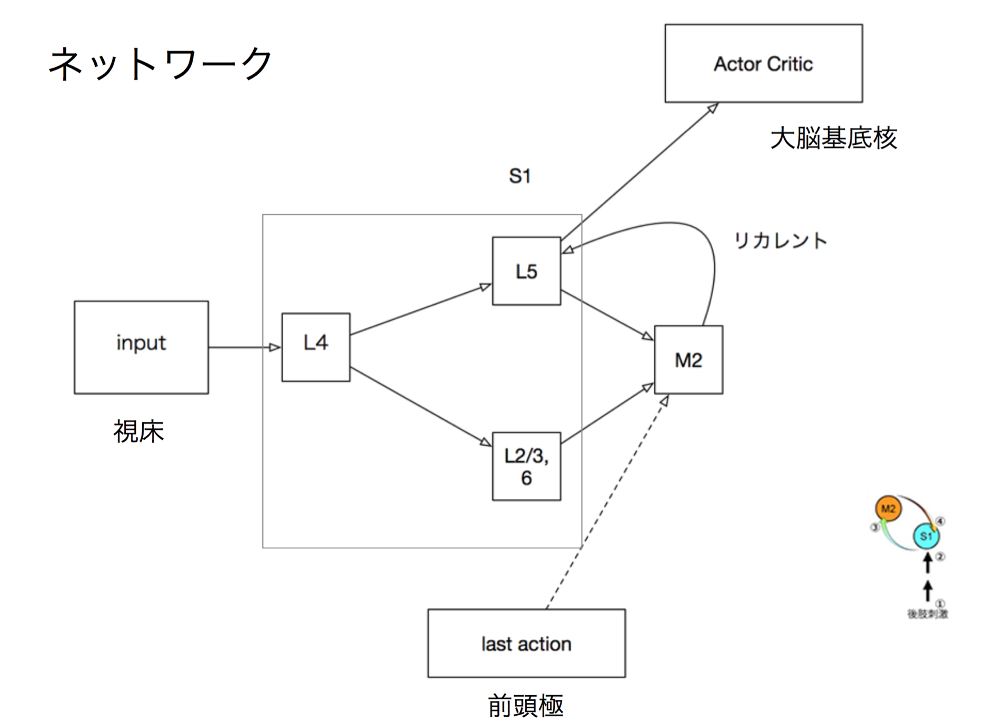

# WBAI 第一回ミニハッカソン コード

http://www.riken.jp/pr/press/2015/20150522_1/

こちらの論文の反響回路を元にして、同じ構造をDeep Learningで再現した場合の触覚の識別性能を強化学習を用いて調べてみました。

詳細は、[pdf](doc/wbai_mini_hackathon_01.pdf)をご覧ください。

# モデルタイプ

| model_type  | model class                   | 説明                                             |
| ------------|-------------------------------|--------------------------------------------------|
| plain       | SomaticSimpleNetwork          | リカレント構造の無い一番シンプルなフルコネクトのネットワーク |  
| rnn         | SomaticRecurrentNetwork       | S1,M2間のリカレント構造を模したネットワーク              |
| rnn_action  | SomaticActionRecurrentNetwork | rnnに前回のアクションを入力として追加したネットワーク      |
| plain_cnn   | SomaticCNNNetwork             | 上のplainモデルににCNNを追加したもの                 |
| rnn_cnn     | SomaticRecurrentCNNNetwork    | 上のrnnモデルにCNNを追加したもの                    |

# 実装メモ
- 入力が2系統(S1のL5とL2/3,6)あって、一方にしかリカレントしない(M2->S1のL5)構造を再現するため、わざわざrnn_cell.pyの中に、自前の`SomaticRNNCell`などを用意しているのですが、この方が性能があがるから、という訳ではなくて、できるだけ脳の構造に近づけて試してみたかった、というのが理由です。
- なので通常のDeep Learning的に考えるのであれば、通常のもとからTensorFlowにあるBasicRNNCellやBasicLSTMCellなどを使って、分岐の無いようなモデルにする方がシンプルになり、性能もよいかもしれません。
- environment.pyがOpenAI Gymとほぼ同じようなインターフェース(reset(), step())になっているので、Chainerなどで動かしたいかたは、このクラスだけ流用して、他を自前で組んで試していただければ。
